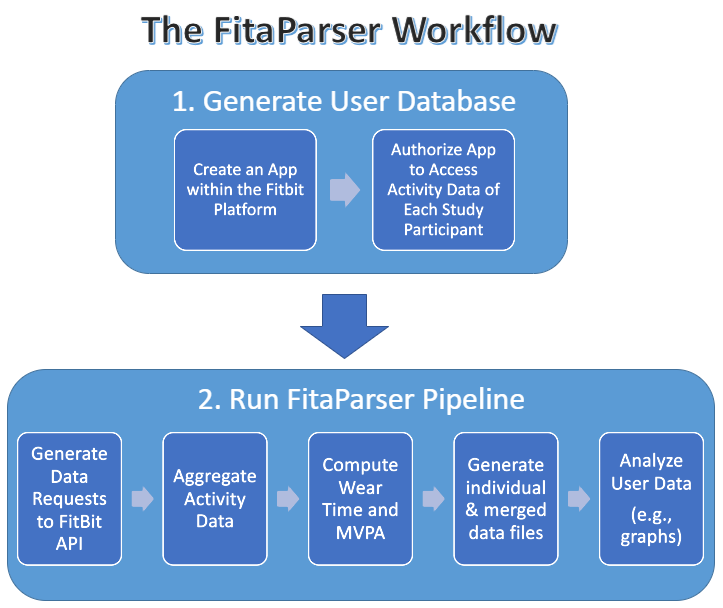

# The FitaParser Workflow

## Overview of FitaParser

The FitaParser Workflow is an open-source data-analysis pipeline built using the workflow management system Snakemake, designed to provide an affordable data aggregation method that significantly expedites the retrieval of longitudinal multi-user Fitbit data. To our knowledge, the only other current options for retrieval and aggregation of longitudinal, multi-user Fitbit data are 1) to pay potentially prohibitive fees to expensive third-party companies to manage this process for you, or 2) spend countless hours manually downloading data from individual participants and aggregating it into a usable format. Depending on the number of participants, metrics gathered, and length of time data was collected, the time needed to do this could also be prohibitive. An additional drawback of the latter (i.e., manual) approach is that Fitbit does not automatically calculate a daily wear time or MPVA-equivalent variable, both of which are standard metrics reported in physical activity research. Beyond the limitations of the existing data aggregation methods, there appear to be no published standards or guidelines instructing physical activity researchers on how to approach the overall collection, retrieval, and aggregation process of multi-user Fitbit data. As in our case, we spent many hours and resources figuring out a process that many previous researchers have likely had to learn before us. While not comprehensive by any means, we hope that this tool can serve as an informative and useful guide for others wishing to utilize Fitbits in their research.

The FitaParser pipeline is capable of producing data that is customizable to your output needs.<br />
&nbsp;&nbsp;&nbsp;&nbsp;&nbsp;&nbsp;-Individual or aggregate data files.<br />
&nbsp;&nbsp;&nbsp;&nbsp;&nbsp;&nbsp;-Daily or intra-day level data.<br />
&nbsp;&nbsp;&nbsp;&nbsp;&nbsp;&nbsp;-Summary graphics of data.<br />
&nbsp;&nbsp;&nbsp;&nbsp;&nbsp;&nbsp;-Output files aggregate all available Fitbit metrics:

      Activity Types (+MVPA)​
      Activity Duration​
      Distance​
      Step Count​
      Heart Rate Data​
      Sleep data​
      Caloric Expenditure​
      Food Logging​
      BMI & Weight​
      Daily Wear Time

Broadly, the FitaParser workflow is a 2-phase process (see infographic below). The first phase requires creation of an application within the Fitbit Platform that is used to access the activity data of each study participant. The second phase involves running the FitaParser pipeline. The pipeline initiates retrieval of Fitbit activity data for the desired date range from all connected participants and aggregates this data into the desired, ready-to-use excel files.​<br />



Below are detailed instructions on how to execute the entire workflow. Please note that while the development of this workflow was made possible by one of our team members with background in computer science and bioinformatics, the purpose and application was driven by our work as behavioral health researchers; thus, the instructions that follow are written largely from that perspective with special consideration to potential challenges faced by behavioral and social science researchers. Throughout the workflow instructions, we have also included our additional thoughts and tips that may be helpful for some researchers who- like ourselves at the beginning of this project- are new to conducting research with consumer wearable devices. We welcome feedback on this tool to help improve usability- please feel free to provide constructive suggestions or inform us of issues encountered when utilizing FitaParser by dropping a comment under the Issues tab.<br />

As we hope this will be an attractive tool for a broad research audience, we are also currently preparing a manuscript outlining the methodology of The FitaParser Workflow in order to more widely disseminate this tool amongst the research community. We plan to upload the preprint version to medRxiv for feedback in the near future and will link that page below.

medRxiv Preprint Link: [coming soon]


## Phase 1: Generate User Database

The first phase of the workflow is to generate the data source that the FitaParser pipeline (described in Phase 2 below) will pull from to generate your final data/output. In this workflow, the data source, itself, is your participant's raw Fitbit data. However, Fitbit user data is protected information that the Fitaparser pipeline cannot readily access. In order to connect the FitaParser pipeline to your data source, you must first register an app for your project using Fitbit's developer API platform that will act as a mediator for FitaParser to access individual user data.<br />

### STEP 1: REGISTER YOUR PROJECT FITBIT APP

1. Before you register your project app, you will need to set up a Fitbit user account (free). We used one of our team member's existing Fitbit accounts.<br />

  > *NOTE. See Fitbit's Web API website for a helpful reference for additional information regarding their developer API and SDK. https://dev.fitbit.com/build/reference/web-api/

2. Once you have a Fitbit account set up, go to dev.fitbit.com and log in to that account.<br />
3. Go to the Register an App tab.<br />
4. Fill in the online form for your project app (see screenshot of our completed form below).<br />
&nbsp;&nbsp;&nbsp;&nbsp;&nbsp;&nbsp;a. We used our lab website for the Application Website URL, Organization Website URL, Terms of Service URL, and Privacy Policy URL.<br />
&nbsp;&nbsp;&nbsp;&nbsp;&nbsp;&nbsp;b. Under "OAuth 2.0 Application Type" select "Client".<br />
&nbsp;&nbsp;&nbsp;&nbsp;&nbsp;&nbsp;c. In the text box under "Redirect URL" enter the following link https://www.google.com/ <br />
&nbsp;&nbsp;&nbsp;&nbsp;&nbsp;&nbsp;d. Under "Default Access Type" select "Read & Write".<br />
&nbsp;&nbsp;&nbsp;&nbsp;&nbsp;&nbsp;e. Click Save.<br />


### STEP 2: SUBMIT REQUEST to FITBIT FOR INTRADAY DATA ACCESS

After registering your app, you will need to submit a request to Fitbit for your app to access authorized user intraday data. This is because Fitbit considers you (and your app) a 3rd-party developer, in which case, access to intraday data is granted on a case-by-case basis. On their website, Fitbit endorses being "very supportive of non-profit and personal" research projects, and this was our experience, as well.<br />

1. To submit an official request to Fitbit, go to https://dev.fitbit.com/build/reference/web-api/intraday-requests/ <br />
2. Complete the online form with the relevant information for your project. The following items on the form do not apply to your application if you are solely using it the purposes of data retrieval and aggregation. Therefore, you can simply say "no" or "does not apply":<br />
&nbsp;&nbsp;&nbsp;&nbsp;&nbsp;&nbsp;"Will you be distributing your application? If so, how and to how many people?"<br />
&nbsp;&nbsp;&nbsp;&nbsp;&nbsp;&nbsp;"Will you be monetizing this application?"<br />
&nbsp;&nbsp;&nbsp;&nbsp;&nbsp;&nbsp;"Will your application display any of the intraday data? If so, please provide a description of how you'll be doing this."<br />
3. Fitbit will be in contact with you to complete/confirm your request via the email address entered in the request form.<br />

### STEP 3: CREATE YOUR FITBIT USER ACCESS TOKEN DATABASE

Before starting on the steps below, you will need to create an excel database to save and organize the user IDs and access tokens that you will be generating. Each token is unique for each participant and you will need it for steps throughout the authorization process, and these will be necessary during Phase 2 when configuring your FitaParser data file (linking FitaParser to your Fitbit app). See the screenshot below for an example of how we organized our excel file.<br />


*After your project app is registered and confirmed access to users' intraday data, and your Fitbit User Access Token Database is created, you can then move on to Steps 4-6.<br />

### STEP 4: GENERATE AUTHORIZATION URL LINK IN FITBIT APP

>*NOTE. Please see Fitbit's https://dev.fitbit.com/build/reference/web-api/oauth2/ website for additional information on the user authorization and API authentication process.

1. Go to dev.fitbit.com.<br />
2. Log into the account under which your Fitbit app is registered (aka: administrator account).<br />
3. Go to Manage > Register an App > Manage My Apps > select your project app.<br />
4. At the bottom of this page, click the blue hyper-link titled "OAuth 2.0 tutorial page" (see example screenshot with the location of the hyperlink highlighted in yellow below).<br />


5. On the next page, you will see two sections: 1. Authorize and 2. Parse Response.<br />
6. Copy the blue hyper-link at the end of the Authorize section (i.e., the "authorization URL"- see example screenshot of authorization URL link in red brackets below) and paste it in your Fitbit User Access Token Database under the "Authorization URL" column in the row next to the participant who will be associated with that specific link.<br />

>*NOTE. Ensure that you are copying the entire link.<br />
*NOTE. This link is valid for 24 hours only. If you do not complete the remaining steps within that time frame, you will need to repeat the above steps again.<br />

7. After you are sure that the above URL is correctly saved, log out of your administrator Fitbit account.<br />


*Before completing STEP 5, ensure that you are logged OUT of your administrator Fitbit account. Also ensure that no one else is logged into Fitbit. We found it helpful to work in two separate browsers when switching between accounts.<br />

### STEP 5: IMPLEMENT PARTICIPANT USER CONSENT TO FITBIT APP

1. Go to fitbit.com.<br />
2. Log into the Fitbit user/participant's account.<br />

>*NOTE. You will need the username and password for this step. The protocol for securing this information from your participants may vary based on several factors. Some questions to consider when designing your protocol...Are you providing Fitbit devices to your participants? If so, will the research team be setting up the device and account information for participants? Or will participants set up their own devices/accounts? Are you including individuals who already own a Fitbit device (and thus have an existing Fitbit account)?<br />
&nbsp;&nbsp;&nbsp;&nbsp;&nbsp;&nbsp;-If the research team is setting up the devices/accounts, then you will be able to set the username, password, and user settings from the beginning which allows for greater control over access to the user data. You will obviously want to maintain this information in a secured, encrypted location.<br />
&nbsp;&nbsp;&nbsp;&nbsp;&nbsp;&nbsp;-If participants are setting up their own devices/accounts, you will need to secure their login credentials and request that they not change this information during their time in the study. This also applied to participants who are allowed to use their existing devices/accounts.<br />
>
>*NOTE. Regardless of which protocol you use to secure your participants' login credentials, you will need to make sure you outline the requirements for providing login credentials, as well as how you will keep that information safe very clear on your participant consent form.<br />

3. Return to where you pasted the authorization URL for this specific participant in your Fitbit User Access Token Database.<br />
4. Copy the URL and paste it into a NEW tab in the same browser that you used to log into the participant Fitbit account. This will take pull up the Fitbit user access authorization page (this is where the Fitbit user consents for your app to access their data). See example screenshot of this page below.<br />


5. Adjust the settings to select the amount of time that you want authorize your app access to the participant's Fitbit account.<br />

>*NOTE. Depending on the length of your study, you will need to make sure you select the option that will include the entire length of participation in your study. If you try to run the FitaParser pipeline after the authorization has expired, it will not be able to access that users' data and you will have to go through this process again to re-authorize the connection. Depending on what you outlined in your protocol and consent form, this may not be possible if that user's participation in the study has already completed. We authorized our app for 1 year.<br />

6. Select all the metrics that you want access to. (We authorized all metrics).<br />
7. Click "Allow".<br />
8. NEXT STEP IS VERY IMPORTANT! After clicking Allow, you will be taken to what appears to be a Google.com. DON'T BE FOOLED! DO NOT CLOSE THIS TAB! Look at the URL in the address bar- you should see a very long URL that begins with "https://www.google.com/#access_token=..." Copy/paste this entire URL and save it in your Fitbit User Access Token Database under the "Parse Response Input Token" column associated with the given participant for whom you just completed the authorization form.<br />

>*NOTE. This "Parse Response Input Token" is DIFFERENT from the original URL link you copied from the OAuth 2.0 tutorial page, which you will see in the next step.<br />

9. After you are sure that you have correctly saved this token, log out of the participant Fitbit account.<br />

*Again, before completing the STEP 6, ensure that you are logged OUT of the participant Fitbit account.<br />

### STEP 6: GENERATE USER ACCESS TOKEN IN FITBIT APP (Used to connect FitaParser to Fitbit app)

1. Go to fitbit.com.<br />
2. Log into your Fitbit administrator account.<br />
3. Open a new tab in this same browser.<br />
4. Go to dev.fitbit.com.<br />
5. Go to Manage > Register an App > Manage My Apps > select your project app.<br />
6. At the bottom of this page, click the blue hyper-link titled "OAuth 2.0 tutorial page".<br />
7. Now, copy/paste the Parse Response Input Token for the selected participant (saved in your Fitbit User Access Token Database) to the text box under the "2.Parse Response" section of this page (See example screenshot below).<br />

>*NOTE. Here you can see that the authorization URL (in red brackets in the screenshot) and the Parse Response Token (shown in the text box) should be different links.<br />

8. After pasting the URL, this will prompt a USER ID and TOKEN to generate underneath the text box (highlighted in yellow in the screenshot below).<br />
9. Copy/paste the USER ID and TOKEN under their respective columns in the appropriate participant row in your Fitbit User Access Token Database.<br />

>*NOTE. The TOKEN is long- be sure that you copy/paste the entire code.  <br />
*NOTE. IT IS CRITICAL that you ensure each participant's USER ID & TOKEN are saved, as you will need these for Phase 2 in configuring the FitaParser pipeline (i.e., connecting FitaParser to your Fitbit app).<br />


>*NOTE. Steps 4-6 can be completed in ~3-5mins per participant. We recommend incorporating this into device/account set-up process for each individual participant. Doing it this way is likely more time efficient, as completing the authorization process for dozens (if not hundreds) of participants at once could quickly add up to a significant chunk of time. Additionally, completing this process for multiple participants at once introduces increased possibility of human error in mixing up Fitbit accounts, authorization URLs, user ids, and tokens between participants.<br />

## Phase 2: Run the FitaParser Pipeline

### Requirements

If installed as recommended, the pipeline automatically handles the installation of required software. For reference, the following programs are used by FitaParser:

    Snakemake (v5.14.0)
    Java (OpenJDK v11.0.6)
    Perl (tested with v5.26.2)
    R (tested with v3.6.2)
      "scales" and "ggplot2" packages

The FitaParser pipeline should work on all modern operating systems and has been specifically tested on Ubuntu 18.04.4, OS X 10.15, and Windows 10 (using Windows Subsystem for Linux*).

*For a great guide on installing WSL in Windows and setting up conda, see https://github.com/kapsakcj/win10-linux-conda-how-to

While FitaParser is meant to be user-friendly and require limited prior computational experience, the initial steps do require executing commands from the command line. For those not accustomed to this procedure, refer to this excellent guide on basic Linux commands.

### Conda Installation

The recommended way to setup the FitaParser pipeline is via **conda** because it also enables any software dependencies to be easily installed.

First, install the Miniconda Python3 distribution (download the latest version [here][id], making sure to download the Python3 version):  
\
`bash Miniconda3-latest-Linux-x86_64.sh`  
\
Answer 'yes' to the question about whether conda shall be put into your PATH. You can check that the installation was succesful by running:  
\
  `conda list`  
\
For a successful installation, a list of installed packages appears.

### Prepare a Working Directory

The FitaParser pipeline creates a number of intermediate and temporary files as different underlying tools are executed. In order to keep these files organized and separated from other FitaParser instances, we recommend creating **an indepedent working directory for each study associated with FitaParser**. While there are several ways to accomplish this, the easiest is to simply clone the FitaParser files from GitHub into a new directory for each independent meCLIP experiment.

First, create a new directory in a reasonable place to use as your working directory.  
\
`mkdir study-name`  
\
Next, clone the FitaParser files from GitHub into that directory:
\
`git clone https://github.com/ajlabuc/meCLIP.git`  
\

### Create Conda Environment with Required Software

The **environment.yaml** file that was downloaded from GitHub can be used to install all the software required by FitaParser into an isolated Conda environment. This ensures that the correct version of the software is utilized and any other dependencies are reconciled.

The default Conda solver is a bit slow and sometimes has issues with selecting the latest package releases. Therefore, we recommend to install Mamba as a drop-in replacement via:
\
`conda install -c conda-forge mamba`
\
Then, to create an environment with the required software:  
\
`mamba env create --name FitaParser --file environment.yaml`  
\
Finally, to activate the meCLIP environment, execute:  
\
`conda activate FitaParser`  
\
To exit the environment once the analysis is complete, you can execute:  
\
`conda deactivate`  

### Customizing Configuration File

One of the few steps in the FitaParser analysis pipeline that actually requires opening a file is customizing the configuration file. This is where you inform the pipeline where relevant files are on your system, namely the database or user tokens generated in Phase 1 (above). A sample configuration file is included in the downloaded files and detailed below.

```
threads: 3

study_name: study_name

user_database: config/userTokens.tsv
```

* **threads:** defines the number of threads available to the pipeline (we recommend one less than the total number of usable CPU cores)

* **study_name:** easily identifiable name of the study that FitaParser will analyze (this will be included in most of the file names and titles)  

* **user_database:** specifies the location of the database file containg the user access tokens generated in Phase 1

### Execute the Analysis Pipeline

Once the location of the user database file are saved into the configuration file, FitaParser can then be executed simply by running the following command within the working directory (where 'N' is the number of CPU cores available to the pipeline):

`snakemake --cores N`

This will automatically retrieve participant Fitbit data and aggregate the individual user files into a  database containing all requested activity metrics, including intraday data. The resulting spreadsheet can then be imported into various analysis packages (SPSS, R, etc.) depending on the needs of the user.

### Final Remarks

By allowing Fitbit user data to be retrieved and analyzed at zero-cost and in a user-friendly manner, we feel this tool offers extreme value to any researcher interested in incorporating the use of Fitbit devices into their physical research.

[id]: https://conda.io/en/latest/miniconda.html
